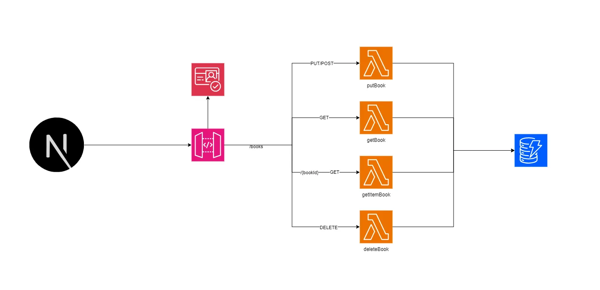
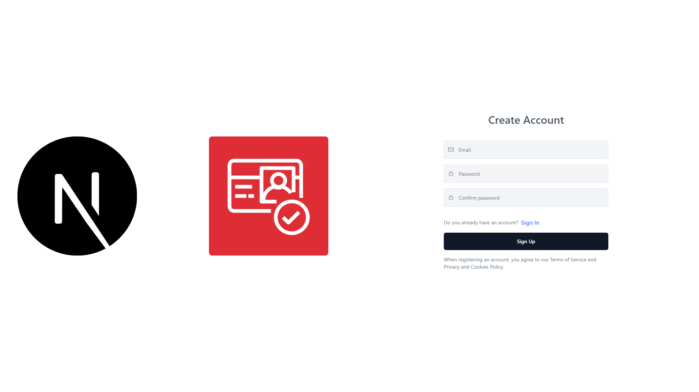
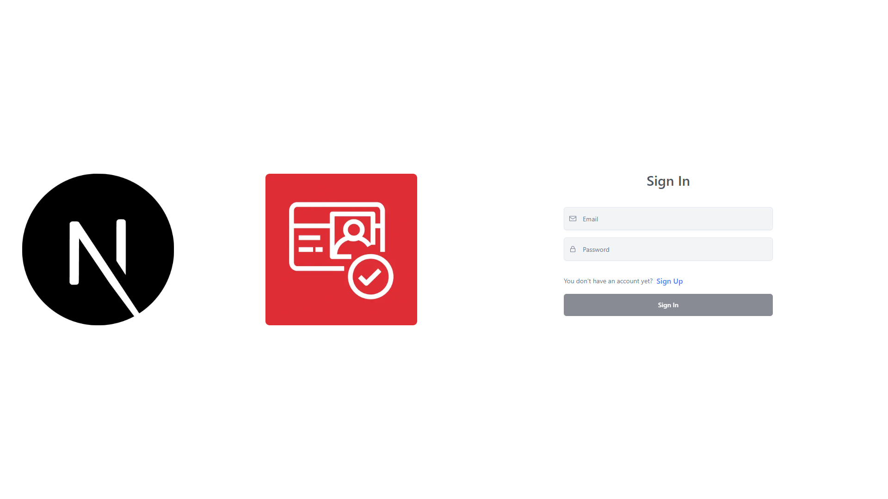
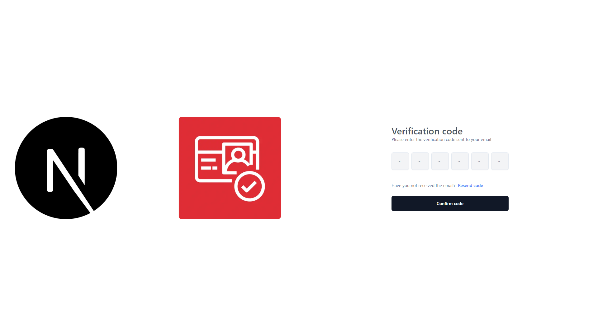
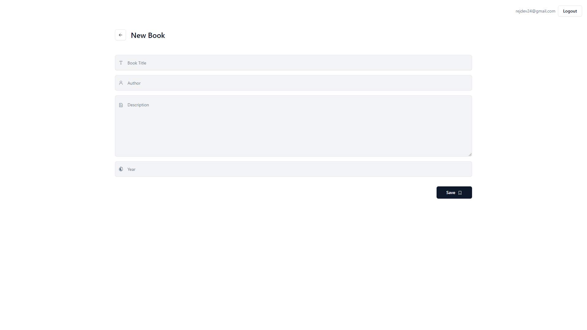
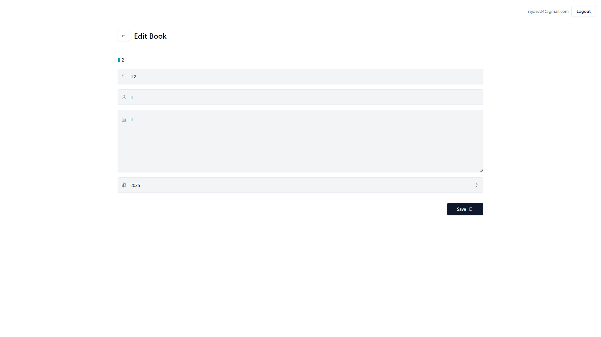

# Next.js 13 + Cognito + API Gateway + Lambda + DynamoDB - Books App Demo

This frontend application serves as a simple demonstration of how to interact with a backend built using AWS CDK.

It performs basic CRUD operations, with API Gateway methods protected by Cognito authorizers. Lambda functions process requests and handle data modifications in DynamoDB.

The frontend is built with `Next.js 13`, `Tailwind CSS`, `Shadcn UI`, and `Typescript`.

> 🚨 **Important**: Please note that this application is experimental and not production-ready.



## Demo 📺

Demo Website: [Next.js 13 + Cognito + API Gateway + Lambda + DynamoDB - Books App Demo](https://main.d1v7b18a5j9npz.amplifyapp.com/)

## Backend 🚀

The backend is built using AWS CDK and can be found in this repository: [books-api-crud-cdk](https://github.com/jer-nc/books-api-crud-cdk)

## Features ✨

- [x] Authentication with Cognito 🔐
- [x] Create book 📚
- [x] Modify book ✏️
- [x] Delete book 🗑️
- [x] List all books 📜
- [x] Get book by ID 🆔
- [x] Sign up 📝
- [x] Sign in 🔑
- [x] Sign out 🚪
- [x] Confirm sign up ✔️
- [x] Resend verification email 📧
- [x] Dashboard protected route 📈
- [ ] Forgot password ❓
- [ ] Change password 🔒
- [ ] Update user attributes 🔄
- [ ] Delete user 🗑️
- [ ] Sign in with Google 📲

## Screenshots 📷

| Sign Up                                    | Sign In                                    | Verify Code                                  | Landing                                      |
| ------------------------------------------ | ------------------------------------------ | -------------------------------------------- | -------------------------------------------- |
|  |  |  |  |

| List Books                                 | Create New Book                            | Edit Book                                    |
| ------------------------------------------ | ------------------------------------------ | -------------------------------------------- |
|  |  |  |

## To Improve 📈

- [ ] Fetch data from API Gateway with `React Query` or something similar
- [ ] Review types and interfaces in the frontend code (some of them are not used)
- [ ] Protected Routes logic 
- [ ] Improve UI/UX
- [ ] Refactor code (some of it is not clean)
- [ ] Add more features


## Getting Started 🚀

### 1. Install Dependencies 📦

```bash
npm install
```

### 2. Configure Cognito ⚙️

Create a Cognito User Pool and a Cognito App Client.
Then, configure the following environment variables:

You can follow the steps described in these YouTube videos: [Youtube Playlist by Evan Does Tech](https://www.youtube.com/watch?v=8WZmIdXZe3Q&t=86s)

### next.config.js

```js
const nextConfig = {
    env: {
        UserPoolId: '<YOUR_USER_POOL_ID>',
        ClientId: '<YOUR_CLIENT_ID>',
    }
}

module.exports = nextConfig
```

### 3. Run the Development Server 🏃‍♂️

```bash
npm run dev
```

## References 📚

- [Next.js 13](https://nextjs.org/docs)
- [cognito-identity-js](https://www.npmjs.com/package/amazon-cognito-identity-js)
- [Youtube Playlist by Evan Does Tech](https://www.youtube.com/watch?v=8WZmIdXZe3Q&t=86s)